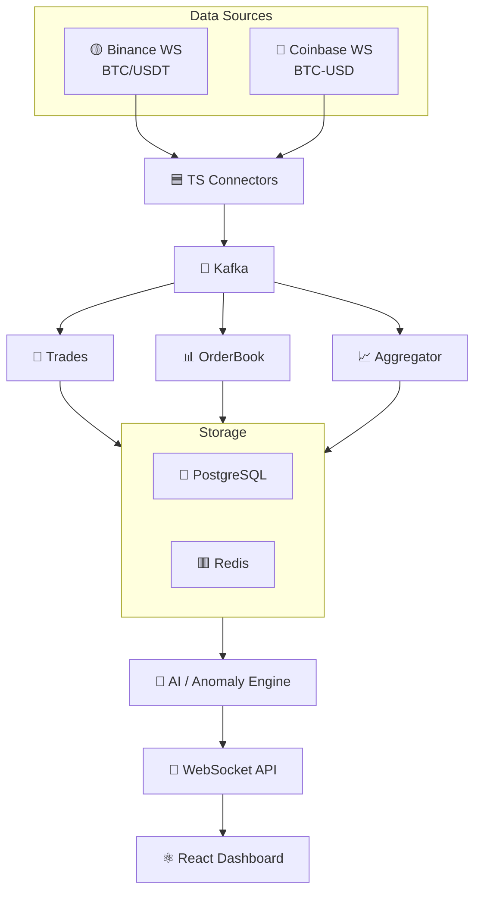

# Crypto Pulse WebSocket

Real-time crypto market data pipeline: ingests live trades and order book updates from Binance (BTC/USDT) and Coinbase (BTC-USD), streams them through Kafka, persists and aggregates them, feeds an anomaly-detection engine, and pushes live updates to a React dashboard over WebSockets.

## Architecture

**Data Sources**

| Exchange | Trading Pair | Streams |
|----------|-------------|---------|
| Binance  | BTC/USDT    | trades, order book (depth) |
| Coinbase | BTC-USD     | trades (matches), order book (level2) |

**Flow**

1. **Binance / Coinbase WebSockets** – sources of raw trade and order book events for BTC/USDT (Binance) and BTC-USD (Coinbase).
2. **TS Connectors** – TypeScript services that subscribe to each exchange's streams and publish normalized events onto Kafka, tagged by exchange and symbol.
3. **Kafka** – message broker decoupling ingestion from downstream processing; fans out to multiple consumers.
4. **Trades / OrderBook / Aggregator** – Kafka consumers that process raw events: persisting trades, maintaining order book state, and computing aggregated metrics (OHLCV, volume, etc.).
5. **PostgreSQL / Redis** – durable storage (PostgreSQL) and low-latency cache/state (Redis) for processed data.
6. **AI / Anomaly Engine** – analyzes stored/streamed data to detect anomalies (price spikes, volume surges, spoofing patterns, etc.).
7. **WebSocket API** – exposes live data and anomaly alerts to clients over WebSockets.
8. **React Dashboard** – front-end visualizing real-time trades, order books, and detected anomalies.

## Status

This project is in early scaffolding. Components in the diagram above represent the intended architecture; see individual service directories (once added) for implementation status.

## Getting Started

_To be filled in as services are implemented (setup, environment variables, running Kafka/PostgreSQL/Redis locally, starting connectors, dashboard, etc.)._

## License

TBD
